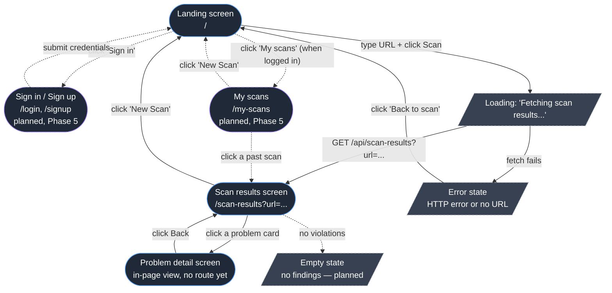
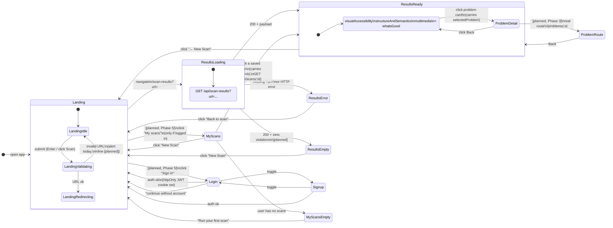
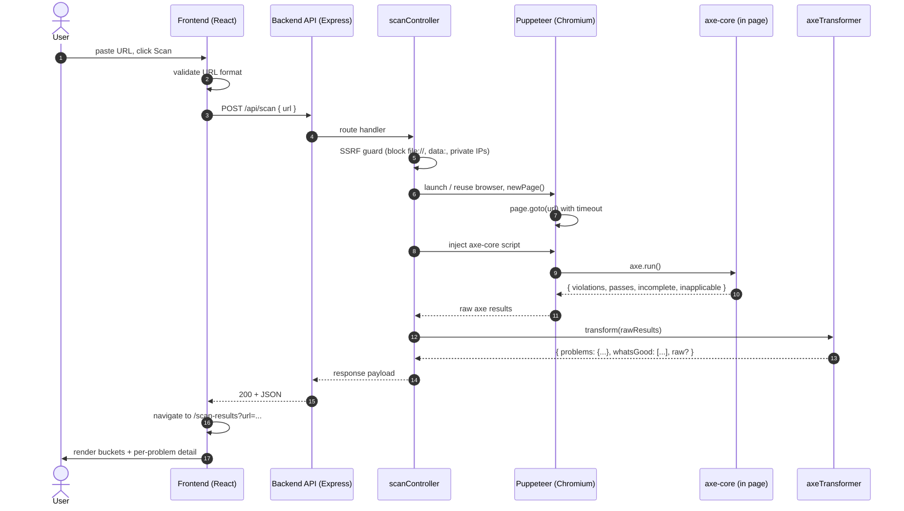

# EqualView — Architecture & UX Map

**Status:** Living document
**Companion to:** [`project-roadmap.md`](project-roadmap.md),
[`axecore-integration-roadmap.md`](axecore-integration-roadmap.md)

This document is the visual map of the product. It answers three
questions in order:

1. **What screens exist and what does each one do?** (UX/UI + behavior)
2. **What does the backend do for each screen?** (endpoints, data)
3. **How is the code organized so the two sides talk cleanly?**

Where a feature is not built yet it is marked **[planned]** so the
current state stays honest.

---

## 1. Screen mindmap

The whole product is three screens, plus error/loading states. Lines
show navigation; round nodes are screens, square nodes are user
actions.



Solid borders = built today. Dashed purple = planned (Phase 5,
accounts & scan history).

---

## 1.5 Screen flow & content map

§1 above answers "what screens exist". This section answers the two
follow-up questions:

1. **How does the user move between them?** — what triggers each
   transition, and what state/params get carried across.
2. **What does each screen contain?** — a region-by-region inventory
   that doubles as a wireframe checklist and tells you exactly which
   piece of backend data feeds which piece of UI.

Cross-references to phases point at
[`project-roadmap.md`](project-roadmap.md). Today vs target is marked
the same way as elsewhere in this doc: **[planned]** = not built yet,
solid = shipped.

### 1.5.1 Transition diagram

This is more granular than the §1 mindmap: every arrow is labeled
with **trigger → carried state**, and loading/error/empty states are
first-class nodes (not footnotes). Solid = built; dashed purple =
planned.



**State that gets carried across transitions** (the contract every
navigation has to honor):

| From → To                        | Carried in                       | Notes                                                                |
| -------------------------------- | -------------------------------- | -------------------------------------------------------------------- |
| Landing → Results                | `?url=<encoded>` query param     | Single source of truth for which URL was scanned.                    |
| Results → Problem detail (today) | `selectedProblem` React state    | Lives in `ScanResults.jsx`; lost on refresh.                         |
| Results → Problem route [planned] | `:id` path param                 | Survives refresh; needs router (Phase 3 decision).                   |
| My scans → Results [planned]     | `?scanId=<id>` (or `/scans/:id`) | Backend serves stored payload instead of running axe.                |
| Login/Signup → anywhere [planned] | httpOnly JWT cookie + `/auth/me` | Frontend never sees the token; gate "My scans" link on `/auth/me`.   |

### 1.5.2 Per-screen content inventory

Each screen is broken into UI regions. For every region: what it
shows, what data it needs, and where that data comes from. Use this
as a wireframe checklist when you start a screen — if a region has no
data source listed, that's a backend gap, not a frontend one.

#### Landing — `/`  (Phase 0/3)

| Region            | Contents                                                | Data source                                  |
| ----------------- | ------------------------------------------------------- | -------------------------------------------- |
| Header            | "equalview" wordmark, one-line subtitle                 | static                                       |
| Auth slot [planned, P5] | "Sign in" link, **or** "My scans · Log out" if authed | `GET /api/auth/me`                          |
| URL form          | `<input type="url">`, "Scan" button (disabled empty / `aria-busy` while scanning) | local state |
| Validation slot   | inline error ("That doesn't look like a URL") **[planned, replaces `alert`]** | client-side `new URL(...)` |
| SR-only hint      | screen-reader-only instructions                         | static                                       |
| Footer [planned]  | links to docs / GitHub                                  | static                                       |

#### Scan results — `/scan-results?url=...`  (Phase 1/2/3)

| Region             | Contents                                                                                  | Data source                                                                                       |
| ------------------ | ----------------------------------------------------------------------------------------- | ------------------------------------------------------------------------------------------------- |
| Header             | "Scan Results for `<url>`", "← New Scan" link                                             | `?url=` from query string                                                                         |
| Loading state      | "Fetching scan results…" spinner                                                          | render while `fetch` pending                                                                      |
| Error state        | message + "Back to scan" button                                                           | thrown from `fetch` / missing `?url=`                                                             |
| Problems — bucket grid | three cards-of-cards: `visualAccessibility`, `structureAndSemantics`, `multimedia`    | `GET /api/scan-results?url=...` → `problems.<bucket>` (today: mock; target: axe-driven)           |
| Needs review bucket [planned, P3] | fourth bucket from axe `incomplete`                                            | same response, new key (depends on Option A/B/C)                                                  |
| Severity badges [planned, P3] | "critical / serious / moderate / minor" chips on each card                       | axe `impact` per violation                                                                        |
| WCAG tag filters [planned, P3] | toggleable chips ("wcag2a", "wcag21aa", …)                                      | axe `tags`                                                                                        |
| What's Good        | list of passing checks                                                                    | response `whatsGood[]`                                                                            |
| Empty state [planned] | "No issues found 🎉" + "Scan another"                                                  | response with zero violations                                                                     |

#### Problem detail — in-page today, `/problems/:id` later  (Phase 2/3)

| Region              | Contents                                          | Data source                                                                |
| ------------------- | ------------------------------------------------- | -------------------------------------------------------------------------- |
| Title               | axe `help` (one-line summary)                     | violation object                                                           |
| Severity badge [planned] | colored chip                                  | axe `impact`                                                               |
| Description         | axe `description` (body copy)                     | violation object                                                           |
| WCAG tag chips [planned] | small chips                                  | axe `tags`                                                                 |
| "Learn more" link [planned] | external link to Deque University         | axe `helpUrl`                                                              |
| Offending nodes list [planned] | per node: `html` snippet, `target` selector, `failureSummary` | axe `nodes[]`                                              |
| Back button         | returns to results grid                           | local state today; router `history.back()` later                           |
| Source [planned]    | either embedded in `/api/scan-results` payload **or** fetched via `GET /problems/:id` — open decision | see §4.3 contract table |

#### Sign in / Sign up — `/login`, `/signup`  [planned, Phase 5]

| Region            | Contents                                                  | Data source                                         |
| ----------------- | --------------------------------------------------------- | --------------------------------------------------- |
| Header            | "Sign in" / "Create an account" + toggle link             | static                                              |
| Form              | email, password (signup: confirm), submit                 | local state                                         |
| Inline errors     | "Email already in use", "Wrong password", etc.            | response from `POST /api/auth/{login,signup}`       |
| "Continue without account" | link back to `/`                                 | static                                              |
| Auth side-effect  | sets httpOnly JWT cookie on success                       | server `Set-Cookie` header                          |

#### My scans — `/my-scans`  [planned, Phase 5]

| Region              | Contents                                                                            | Data source                                              |
| ------------------- | ----------------------------------------------------------------------------------- | -------------------------------------------------------- |
| Header              | "My scans", "New Scan" button, account menu (Log out)                               | `GET /api/auth/me`                                       |
| Scan list / table   | per row: scanned URL, date, headline counts ("3 critical · 7 serious · 12 review"), "View", "Delete" | `GET /api/scans?page=N`                            |
| Pagination          | next / prev (or infinite scroll)                                                    | response `pageInfo`                                      |
| Per-row delete confirm | modal "Delete this scan?"                                                        | `DELETE /api/scans/:id`                                  |
| Empty state         | "No scans yet" + CTA to `/`                                                         | empty list response                                      |
| Auth gate           | redirects to `/login` if `/auth/me` returns 401                                     | `GET /api/auth/me`                                       |

### 1.5.3 Phase mapping

A quick cross-reference so it's obvious which screen lights up in
which phase of [`project-roadmap.md`](project-roadmap.md):

| Screen / transition                            | Lands in phase                                                                                       |
| ---------------------------------------------- | ---------------------------------------------------------------------------------------------------- |
| Landing form, redirect to results              | already shipped (Phase 0)                                                                            |
| Real `POST /api/scan` from landing             | [Phase 2 — real scanner](project-roadmap.md#phase-2--real-scanner-axe--puppeteer)                    |
| Bucketed results render                        | already shipped against mock; promoted to real data in Phase 2                                       |
| Severity badges, WCAG filters, "Needs review" bucket, real router, problem route | [Phase 3 — UX](project-roadmap.md#phase-3--ux--ui-on-real-data) |
| Loading / error / empty polish                 | [Phase 3](project-roadmap.md#phase-3--ux--ui-on-real-data) + [Phase 4 — reliability](project-roadmap.md#phase-4--reliability--ops) |
| Sign in / Sign up, My scans, auth gating, scan history | [Phase 5 — accounts & scan history](project-roadmap.md#phase-5--accounts--scan-history)      |

---

## 2. Per-screen breakdown

Each screen below has the same four sections so it's easy to scan:
**Purpose**, **UI elements**, **What the user can do**, **What the
backend does**.

### 2.1 Landing screen — `/`

**File:** `frontend/src/landingPage.jsx`

**Purpose.** Single entry point. Get a URL from the user and send them
to a results page for it.

**UI elements.**
- App title (`equalview`) + one-line subtitle.
- Single text input (`type="url"`, labeled for screen readers).
- "Scan" button (disabled while empty or while a scan is in flight,
  `aria-busy` while scanning).
- Hidden hint text exposed to screen readers.

**What the user can do.**
- Type a URL and press Enter or click Scan.
- See a basic client-side URL validation error (`alert`, **planned**:
  inline message instead).

**What happens on submit (current).**
1. `new URL(url)` validates the format client-side.
2. State flips to `scanning`; button shows "Redirecting…".
3. After a 1.2 s `setTimeout`, `window.location.href` jumps to
   `/scan-results?url=<encoded>`. The actual scan request is fired by
   the next screen, not here.

**What happens on submit (target — Phase 2/3).**
1. Validate URL.
2. `POST /api/scan { url }` to kick off the scan.
3. On success, navigate via the router (decision pending) to
   `/scan-results?url=...` carrying either the results or a job id.
4. Show real loading/progress while the scan runs (kill the
   `setTimeout`).

**What the backend does today.** Nothing. The submit on this screen is
purely a redirect.

---

### 2.2 Scan results screen — `/scan-results?url=...`

**File:** `frontend/src/ScanResults.jsx`
**Sub-component:** `frontend/src/components/ProblemSolutionPage.jsx`

**Purpose.** Show what the scanner found for the URL in the query
string, grouped so a non-technical user can understand it.

**UI elements.**
- Header: "Scan Results for `<url>`" + "← New Scan" link.
- "Problems" section — three buckets (current shape):
  `visualAccessibility`, `structureAndSemantics`, `multimedia`.
- "What's Good" section — what the page got right.
- Each problem renders as a card the user can click.
- Loading and error states render in place of the grid.
- **Planned (Phase 3):** a fourth bucket "Needs manual review" backed
  by axe's `incomplete` array; severity badges driven by axe `impact`;
  WCAG tag filters.

**What the user can do.**
- Read the buckets.
- Click any problem card → in-page detail view (see 2.3).
- Click "← New Scan" → back to landing.

**What happens on load (current).**
1. `useEffect` reads `?url=` from the query string.
2. If missing → error state ("No URL provided in query params").
3. Otherwise: `GET /api/scan-results?url=<encoded>` → render the JSON.
4. Backend ignores the URL today and returns the same mock object
   regardless.

**What happens on load (target — Phase 2).**
1. Same kickoff, but the backend really runs Puppeteer + axe-core for
   that URL and returns either:
   - the bucketed shape (Option B), **or**
   - bucketed summary + `raw` axe arrays (Option C).
   Decision tracked in
   [`project-roadmap.md`](project-roadmap.md#open-decisions-lock-in-before-they-block-a-phase).
2. Render violations sorted by `impact`.
3. Render an "incomplete" bucket if non-empty.

**What the backend does.**
- **Today:** `GET /api/scan-results?url=...` returns
  `backend/data/mockScanResults.js` verbatim.
- **Target:** route → controller → Puppeteer (`page.goto(url)`) →
  inject axe-core → `axe.run()` → `axeTransformer` → JSON.

---

### 2.3 Problem detail "screen" — in-page view

**File:** `frontend/src/components/ProblemSolutionPage.jsx`
**Routing:** none yet — it's conditional rendering inside
`ScanResults.jsx` based on `selectedProblem` state.

**Purpose.** Show one problem in depth: what it is, why it matters,
how to fix it, and where it appears on the page that was scanned.

**UI elements (today, mock-driven).** Title, description, fix
suggestion(s), back button.

**UI elements (target — Phase 2/3, axe-driven).**
- `help` as headline.
- `impact` as a colored badge.
- `description` as the body.
- A "Learn more" link to `helpUrl` (Deque University remediation
  guidance — this is "the recommendation").
- WCAG `tags` as small chips.
- A list of offending nodes: `html` snippet + `target` selector +
  `failureSummary` per node.

**What the user can do.** Read it; click "Back" to return to the
results grid; **planned:** click the "Learn more" link; **planned:**
copy a selector.

**What the backend does.** Either:
- `GET /problems/:id` returns one problem (current; mock).
- Or the problem object is already inside the results payload and the
  frontend doesn't refetch (likely the right call once the response
  shape is finalized).

---

### 2.4 Sign in / Sign up — `/login`, `/signup` [planned, Phase 5]

**File (target):** `frontend/src/pages/Login.jsx`,
`frontend/src/pages/Signup.jsx`.

**Purpose.** Let a returning user identify themselves so the backend
can attach scans to their account and show their history.

**UI elements.** Email + password fields, submit button, link to
toggle between sign in and sign up, inline validation errors, a
"continue without an account" link back to `/`.

**What the user can do.**
- Sign up with email + password.
- Log in with the same.
- Log out (from the header on any screen once authenticated).

**What the backend does.**
- `POST /api/auth/signup { email, password }` → create user, set
  httpOnly JWT cookie.
- `POST /api/auth/login { email, password }` → verify, set cookie.
- `POST /api/auth/logout` → clear cookie.
- `GET /api/auth/me` → return the current user (or 401), used by the
  frontend on every page load to know whether to show "My scans".

**Whether we build it ourselves vs use a managed provider** is an
open decision in
[`project-roadmap.md`](project-roadmap.md#phase-5--accounts--scan-history).

---

### 2.5 My scans — `/my-scans` [planned, Phase 5]

**File (target):** `frontend/src/pages/MyScans.jsx`.

**Purpose.** A returning user's home base — every scan they have run,
newest first, click to re-open.

**UI elements.**
- Header: "My scans" + "New Scan" button.
- A list (or table) of past scans, each row showing: scanned URL,
  date, headline counts (e.g. "3 critical · 7 serious · 12 needs
  review"), and a "View" link.
- Pagination or infinite scroll once the list grows.
- Per-row "Delete" action with a confirm.
- Empty state when the user has no scans yet — links back to `/`.

**What the user can do.**
- Click a row → land on the same `/scan-results?...` screen, but the
  results come from the database instead of a fresh scan.
- Delete a scan.
- Start a new scan from the header.

**What the backend does.**
- `GET /api/scans?page=N` → paginated list of the current user's
  scans (auth-required).
- `GET /api/scans/:id` → one scan (auth-required, 404 if it isn't
  yours).
- `DELETE /api/scans/:id` → remove it.
- When the results screen is opened from a saved scan, it can fetch
  by id instead of re-running axe — same render path, different data
  source.

---

## 3. End-to-end scan sequence (target state)

This is what we're building toward. Today the scanner box is replaced
with "return mock" — everything else is the same.



---

## 4. Code organization

The split is simple: **frontend is dumb about scanning, backend is
dumb about presentation.** The wire format between them is the only
contract that matters.

### 4.1 Frontend (`frontend/`)

```
frontend/src/
├── main.jsx                       # React bootstrap
├── App.jsx                        # routing — pathname switch today,
│                                  #   react-router [planned, Phase 3]
├── landingPage.jsx                # Screen 2.1
├── ScanResults.jsx                # Screen 2.2 (also hosts 2.3 today)
├── components/
│   └── ProblemSolutionPage.jsx    # Screen 2.3
├── data/
│   └── mockScanResults.js         # offline fallback for tests / dev
├── styles/                        # plain CSS per screen
└── _tests_/                       # Vitest + React Testing Library
                                   #   (folder name is a typo of the
                                   #   __tests__ convention — rename
                                   #   in Phase 0 housekeeping)
```

**Responsibilities.**
- Validate input (URL format) before calling the API.
- Talk to the backend through `/api/*` (Vite proxies these to
  `localhost:3000` in dev).
- Own all rendering, sorting, filtering, and bucket grouping if we go
  with Option A (raw axe arrays). If we keep Option B/C, the frontend
  just renders what the backend hands it.
- Own all navigation between screens.

**What the frontend never does.**
- It never imports Puppeteer or axe-core.
- It never makes outbound calls to a scanned site directly (that's the
  backend's job — and a CORS/SSRF problem if it tried).

### 4.2 Backend (`backend/`)

```
backend/
├── index.js                       # express app + middleware + listen
├── routes/
│   ├── scan.js                    # /api/scan, /api/scan-results,
│   │                              #   /problems/:id  [planned, Phase 1]
│   ├── auth.js                    # /api/auth/*  [planned, Phase 5]
│   └── scans.js                   # /api/scans/* (history)  [planned, Phase 5]
├── controllers/
│   ├── scanController.js          # request/response + drives Puppeteer
│   │                              #   [planned, Phase 1]
│   ├── authController.js          # signup/login/logout/me  [planned, Phase 5]
│   └── scansController.js         # list / get / delete saved scans  [planned, Phase 5]
├── services/
│   ├── axeTransformer.js          # axe → API shape, pure function,
│   │                              #   easy to unit test  [planned, Phase 1]
│   └── auth.js                    # password hashing, JWT sign/verify
│                                  #   [planned, Phase 5]
├── middleware/
│   └── requireAuth.js             # gate protected routes  [planned, Phase 5]
├── db/                            # [planned, Phase 5]
│   ├── client.js                  # pg pool / Prisma client
│   ├── migrations/                # users, scans schema
│   └── repositories/
│       ├── usersRepo.js
│       └── scansRepo.js
├── data/
│   └── mockScanResults.js         # used as a fixture in tests
├── tests/                         # supertest + chosen runner
│                                  #   [planned, Phase 1 — runner
│                                  #   decision still open]
├── Dockerfile                     # [planned, Phase 1]
└── .env.example                   # PORT, FRONTEND_ORIGIN, JWT_SECRET,
                                   #   DATABASE_URL  [planned, Phase 1/5]
```

**Layered responsibilities.**

| Layer        | Knows about           | Doesn't know about       |
| ------------ | --------------------- | ------------------------ |
| `routes/`    | Express, URL paths    | Puppeteer, axe shape     |
| `controllers/` | HTTP req/res, Puppeteer driver | how axe maps to UI buckets |
| `services/`  | axe input → API output (pure) | Express, Puppeteer       |
| `data/`      | Static fixtures       | Anything else            |

This split is what lets `axeTransformer.js` be unit-tested with a
captured axe payload and no browser — and what lets routes be swapped
or renamed without touching scanning logic.

### 4.3 The contract between them

For each screen, the request → response contract is:

| Screen       | Request                                | Response (target)                           |
| ------------ | -------------------------------------- | ------------------------------------------- |
| Landing      | `POST /api/scan { url }`               | full results JSON (sync) **or** `{ jobId }` |
| Scan results | `GET /api/scan-results?url=<encoded>`  | full results JSON                           |
| Problem      | (in-payload) **or** `GET /problems/:id` | one problem object                         |

The exact JSON shape depends on the open "Scan API shape" decision in
[`project-roadmap.md`](project-roadmap.md#open-decisions-lock-in-before-they-block-a-phase).
Whichever option wins, the per-violation fields we surface to the UI
are fixed by axe-core itself: `id`, `help`, `helpUrl`, `impact`,
`tags`, and `nodes[].{html, target, failureSummary}`. Those are the
"recommendation" data — see
[`project-roadmap.md` § What axe-core actually returns](project-roadmap.md#what-axe-core-actually-returns).

---

## 5. Where to look when X breaks

A quick lookup table for debugging — keep this updated as the codebase
moves.

| Symptom                                                    | Likely file                              |
| ---------------------------------------------------------- | ---------------------------------------- |
| Landing page: clicking Scan does nothing                   | `frontend/src/landingPage.jsx`           |
| Results page stays on "Fetching scan results..."           | network tab → `/api/scan-results` → `backend/index.js` (today) / `routes/scan.js` (target) |
| Results render but a problem card crashes on click         | `frontend/src/ScanResults.jsx` (`setSelectedProblem` wiring) + `components/ProblemSolutionPage.jsx` |
| CORS error in browser console                              | `backend/index.js` `cors({ origin })` and `FRONTEND_ORIGIN` env |
| "MODULE_NOT_FOUND: cors" on backend start                  | `backend/package.json` (dep must live there, not at repo root) |
| Scan returns 500 on a real URL                             | `controllers/scanController.js` Puppeteer error handling [planned, Phase 4] |
| Same mock returned for every URL                           | expected today — until Phase 2 lands     |
